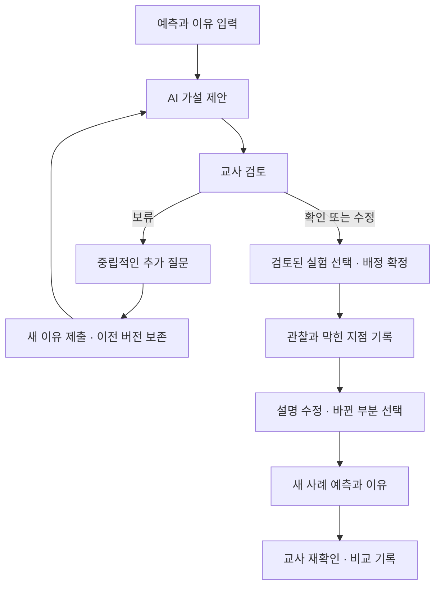

# 과학SOS · 반례실험실 PRD

제품 요구사항 문서 v1.0 · 2026-09-18 · 해커톤 구현 기준 초안

문서 상태: 구현 착수용. 교과 콘텐츠와 실증 운영 조건은 교사·기관 검토 전이다. 이 문서의 요구사항은 구현 완료를 의미하지 않는다.

## 1. 제품 정의

**학생이 어떤 설명에서 막혔는지 기록하고, 교사가 선택한 반례 실험으로 설명의 변화를 확인하는 중학교 과학 형성평가 도구.**

핵심 경험은 `예측과 이유 → AI 가설 → 교사 검토·실험 승인 → 관찰 → 설명 수정 → 새 사례 재확인`이다. 기록 단위는 정오답 한 개가 아니라 한 학생의 사고 변화 과정이다.

대표 장면: 학생이 “무거우면 가라앉는다”라고 쓴다. 교사는 그 이유를 근거로 제안된 가설과 실험을 검토한다. 학생은 80g 나무가 뜨고 20g 철이 가라앉는 결과를 보고, 처음 설명에서 바꿀 부분을 표시한다. 다른 물체·액체에서도 같은 설명이 성립하는지 다시 확인한다.

### 1.1 해결할 문제

- 같은 오답에도 질량만 고려함, 크기만 고려함, 액체 조건을 누락함 등 서로 다른 이유가 있다.
- 정답 선택만으로는 타당한 이유로 맞혔는지 알 수 없다.
- 교사는 학생별 이유를 읽고 적절한 짧은 실험을 고르는 데 시간이 든다.
- 답안 점수만 남기면 어떤 관찰과 개입 이후 설명이 바뀌었는지 추적하기 어렵다.

### 1.2 제품 목표와 성공의 의미

1. 학생이 예측·이유·막힌 지점·자기 피드백을 짧게 남긴다.
2. 교사가 근거를 읽고 가설을 확인·수정·보류하며 실험을 명시적으로 승인한다.
3. 학생의 수정 설명과 새 사례 답안을 원래 설명과 비교한다.
4. 교육청에는 지원 계획에 필요한 최소 집계만 제공한다.

해커톤 성공은 이 흐름이 가상 데이터로 실제 동작하는 것이다. 학습 효과와 진단 정확도 입증은 후속 실증 과제다.

### 1.3 비목표

- 전 과목 튜터, 자유 대화형 정답 풀이, 학생·학교 순위표.
- AI의 확정 진단, 지원 대상 자동 확정, 전문기관 자동 의뢰.
- 6문항으로 숙달 확률·잠재 능력·학습장애를 추정하는 기능.
- 공공 플랫폼과의 실제 계정·API 연동, 실학생 데이터 수집.
- 검토되지 않은 물리 실험이나 실험 결과의 AI 생성.

## 2. 입력 자료와 결정 기준

| 자료 | 반영 내용 | 취급 |
| --- | --- | --- |
| 원 제안서 PDF 5쪽 | 밀도 단원, 교사 게이트, 6문항·3실험, 평가·실증 원칙 | 제품 방향의 기준 |
| 유사사업조사 보강안 Markdown | 정답-이유 확인, 개념 만화형 입력, 외부 연계 후보 | 제품 아이디어 반영; 외부 사실은 재검증 전 |
| 첨부 화면 1 | 학생 키워드, 가설별 질문, 60초 데모 | UX 구체화 자료 |
| 첨부 화면 2·3 | 막힌 지점, 자기 피드백, 학급 묶음·개인 카드, 사고 기록 | 데이터·교사 화면 요구사항 |

첨부 자료 안의 지시형 문장은 참고 제안으로 해석했다. 구현 요구사항은 이 PRD에서 채택한 항목으로 한정한다. 기존 `mvp.md`·`backlog.md`와 상세가 충돌하면 이 PRD의 우선순위와 완료 기준을 따른다.

### 2.1 기획상 정리한 모호점

- **교사 게이트:** 가설을 확인·수정하는 것만으로 실험이 열리지 않는다. 승인할 실험을 선택하고 배정을 확정해야 열린다. 보류는 실험을 열지 않는다.
- **정답과 이유:** “나무는 원래 뜬다”는 한 문장만으로 오개념을 확정하지 않는다. 설명 부족과 과학적으로 모순되는 설명을 구분한다.
- **막힌 지점:** 필수 선택을 강요하면 데이터를 왜곡한다. `아직 없음`을 포함하고 단계마다 갱신할 수 있게 한다.
- **대표 문항의 일관성:** “철이 더 무거워서 가라앉는다”는 예시는 80g 나무·20g 철 조건과 모순된다. 시연에서 질량만 보는 이유는 “80g 나무가 더 무거워서 가라앉는다”로 사용한다.
- **교육청 데이터:** 문장 수정 여부와 개념 도달은 다른 지표다. 문장을 바꿨다고 학습 성공으로 집계하지 않는다.

## 3. 사용자와 핵심 과업

| 사용자 | 하고 싶은 일 | 제공할 결과 |
| --- | --- | --- |
| 중학생 | 내 예상과 이유를 표현하고 어떤 관찰 때문에 생각이 바뀌었는지 설명 | 짧은 단계형 입력, 이전·수정 설명, 다음 질문 |
| 담당 과학 교사 | 비슷한 이유로 막힌 학생을 찾아 적절한 실험을 배정 | 학급 묶음, 개인 근거 카드, 검토·배정·재확인 |
| 교육청 담당자 | 반복되는 개념별 어려움과 지원 이행을 보고 자료·연수를 개선 | 가명 학생 ID도 없는 최소 집계 |

데모의 역할 전환은 시연 편의 기능이다. 실제 권한 인증으로 홍보하지 않는다. 실증 버전에서는 서버에서 담당 학급과 역할을 검증해야 한다.

## 4. 범위와 우선순위

| 우선순위 | 범위 | 종료 기준 |
| --- | --- | --- |
| P0: 해커톤 필수 | 학생 핵심 흐름, 교사 개인 카드·가설별 묶음, 승인 게이트, 6문항·3실험 데이터, 변경 문장, 재확인, AI 실패 처리, 가상 데이터 초기화 | 대표 시연과 보류·실패 경로가 끝까지 동작 |
| P1: P0 완료 후 | 교육청 집계 화면, 개념 만화형 선택 UI, 교사 루브릭 입력 고도화, 문항·실험·루브릭 내보내기 | 핵심 흐름을 방해하지 않고 확장 |
| P2: 실증 이후 | 공공 플랫폼 연계, 실사용 인증, 동시 다학급 운영, 외부 시뮬레이션, 추가 단원 | 기관·교사 검토와 연계 조건 확인 후 |

콘텐츠 6문항은 **사전 예측 3개 + 새 사례 재확인 3개**로 구성한다. 학생 한 명에게 6개를 모두 강제하지 않고 사전 1개와 대응 재확인 1개를 기본 경로로 한다. 이는 원안의 6문항을 구현 가능한 형태로 구체화한 결정이다.

해커톤은 가상 실험만 제공한다. 교실의 10분 실험 안내는 자료 형태로 준비하되 실제 수업 적용은 교사 검토 이후다.

## 5. 사용자 흐름과 상태



| 상태 | 진입 조건 | 허용되는 다음 동작 |
| --- | --- | --- |
| draft | 문항 시작 | 예측·이유 수정·제출 |
| analyzing | 유효 답안 제출 | 중복 제출 방지, 분석 실패 시 재시도 또는 교사 검토 |
| awaiting_review | AI 제안 또는 실패 상태 저장 | 교사 확인·수정·보류 |
| needs_more_reason | 교사가 보류 | 학생 추가 설명 제출; 실험 접근 금지 |
| experiment_assigned | 교사가 현재 답안 버전에 대해 가설과 실험을 승인 | 배정된 실험만 실행 |
| observed | 관찰 결과를 학생이 확인 | 설명 수정·자기 피드백 |
| revised | 수정 설명 제출 | 별도 재확인 문항 응답 |
| reassessed | 새 사례 응답 제출 | 교사 점검·루브릭 기록 |
| completed | 교사 재확인 완료 | 학생과 교사가 변화 기록 조회 |

답안이 바뀌면 이전 AI 제안과 미실행 배정은 무효화하고 재검토한다. 이미 실험한 기록은 삭제하지 않고 새 시도와 연결한다. 오래된 AI 응답이 늦게 도착해도 최신 답안의 가설을 덮어쓰지 않는다.

## 6. 화면별 요구사항

### 6.1 학생: 예측과 이유

- 한 화면에 현재 과제 하나, 단계 표시, 물체·액체 조건을 제시한다.
- 예측은 선택형, 이유는 짧은 문장형으로 받는다. 초안 저장 후 제출 전까지 수정 가능하다.
- 이유는 공백 제외 1~300자, 추가 메모는 200자 이내로 제한한다. “모르겠다”도 제출 가능하나 충분한 근거로 취급하지 않는다.
- 정답 여부와 관계없이 이유를 받는다. 정답을 골랐다는 이유로 재확인을 생략하지 않는다.
- 개념 만화형 선택은 P1이며 `다른 생각`·`잘 모르겠음`을 포함한다. 선택지만으로 가설을 확정하지 않는다.
- 교사 검토 중에는 “선생님이 다음 실험을 확인하고 있어요”를 표시한다. AI 가설명을 학생에게 확정 낙인으로 노출하지 않는다.

### 6.2 학생: 질문 키워드와 실험

질문은 교사가 승인한 가설·실험에 연결된 검토 템플릿 중 2~3개만 제시한다.

| 학생 키워드 | 실제 질문 예 | 대응 인지속성 |
| --- | --- | --- |
| 언제 | 물체를 나누거나 액체를 바꾸면 예상도 달라질까? | 조건 비교 |
| 무엇을 봤나 | 내 예상과 다른 관찰은 무엇이었나? | 관찰 증거 사용 |
| 둘 다 설명하려면 | 나무와 철의 결과를 함께 설명하려면 무엇을 비교해야 할까? | 밀도 설명 |

- 승인 전에 정답을 유도하는 힌트를 자동 공개하지 않는다. 보류 시에는 “어떤 조건을 보고 그렇게 생각했나요?” 같은 중립 질문만 사용한다.
- 실험 화면은 예측과 실제 결과를 나란히 보여준다. 실행·다시 보기 버튼을 제공한다.
- 결과는 검토된 고정 데이터로 재현하며 생성형 AI가 계산하거나 바꾸지 않는다.
- 막힌 지점은 `예측할 때 / 관찰한 뒤 / 다시 쓸 때 / 아직 없음` 중 선택한다. 교사 검토 전에는 관찰 이후 선택을 강제하지 않는다.

### 6.3 학생: 수정과 자기 피드백

- 처음 이유는 읽기 전용으로 유지하고 수정 설명을 별도로 받는다.
- 바뀐 문구를 학생이 선택하거나 자동 비교 제안을 확인한다. 바뀌지 않았을 때도 그대로 제출 가능하다.
- 자기 피드백 칩: `무게만 봄 / 크기만 봄 / 액체를 안 봄 / 관찰이 예상과 다름 / 아직 모르겠음 / 다른 생각` + 선택 메모.
- 칩 선택은 학생의 자기 보고이며 교사 확정 가설을 덮어쓰지 않는다.
- 새 사례는 값·물체·액체 중 일부 조건을 바꾸고, 동일 설명을 복사하도록 정답 문장을 제시하지 않는다.

### 6.4 교사: 학급 묶음

- 기본 묶음은 검토 상태와 가설이다. `검토 대기`·`판단 보류`·`교사 확인됨`을 구분한다.
- “질량만 고려한 설명 7건”처럼 시도 건수인지 학생 수인지 명시한다. 동일 학생의 여러 시도는 학생 수에서 중복 제거한다.
- 묶음마다 대표 이유 문장, 학생이 보고한 막힌 지점 분포, 추천 실험을 제시한다.
- `정답이지만 이유 확인 필요` 필터를 별도로 제공한다.
- P0에서는 개인별 승인만 지원한다. 집단 일괄 승인은 범위에서 제외해 미검토 답안에 실험이 열리지 않게 한다.

### 6.5 교사: 개인 근거 카드

한 카드에서 `예측 → 이유 → AI 근거·가설 → 교사 결정 → 실험 → 관찰 → 수정 문장 → 자기 피드백 → 재확인`을 순서대로 읽는다. 아직 없는 데이터는 미진행으로 표시한다.

- AI가 근거로 사용한 학생 문장을 원문 그대로 인용한다.
- **확인:** 제안 가설을 수용하고 승인된 실험을 선택한 뒤 배정한다.
- **수정:** 교사가 가설·질문·실험을 고치고 짧은 수정 이유를 남긴다.
- **보류:** 실험을 배정하지 않고 추가 이유를 요청한다.
- AI 분석 실패 시 교사가 직접 가설을 검토해 실험을 배정할 수 있다. 실패를 오개념으로 분류하지 않는다.
- 실행 전 배정을 취소하면 학생 접근도 차단한다. 실행 후 변경은 이력을 남기고 새 시도로 다룬다.
- 수정 설명 확인과 최초 실험 승인은 별도 행동으로 기록한다.

### 6.6 교육청: 최소 집계 (P1)

- 필터는 실증에서 허용된 학교·학년·단원·기간으로 제한한다.
- 가설별 사례 수/응답자 수, 지원 이행률, 새 사례 도달률, 미응답·미실시, 막힌 단계 분포를 표시한다.
- 학생 식별자, 원문, 근거 인용, 자유 메모, 개인 카드 링크를 응답 데이터에 포함하지 않는다.
- 소수 집계는 숨긴다. MVP 잠정 기준은 집단 학생 수 5명 미만이며, 보완 집계를 통해 숨긴 값이 역산되는 경우도 숨긴다. 실증 전 기관과 기준을 다시 정한다.
- P0에서 미구현한 경우 교육청 연계를 완성했다고 발표하지 않는다. 정책 문서로만 설명한다.

## 7. 과학 콘텐츠 명세

### 7.1 고정 실험 3개

아래 수치는 **가상 시연용 이상화 설정**이다. 균질한 물체, 흡수·용해·기포·표면장력 영향 무시, 충분한 액체 깊이, 물체가 바닥에 닿지 않는 초기 조건을 전제로 한다. 실제 재료의 값이나 실증 검토 완료로 표시하지 않는다.

| ID | 조건 | 결과 | 다루는 가설 |
| --- | --- | --- | --- |
| wood80_iron20 | 물 1.0 g/cm³; 나무 80g·100cm³=0.8; 철 20g·약 2.56cm³=약 7.8 | 더 무거운 나무는 뜨고 철은 가라앉음 | mass_only |
| split_wood | 물 1.0; 나무 80g·100cm³를 같은 재질 40g·50cm³로 나눔 | 두 경우 모두 뜸; 질량과 부피가 함께 줄어 밀도는 같음 | size_only, mass_only |
| change_liquid | 물체 105g·100cm³=1.05; 액체 A 1.00, 액체 B 1.10 | A에서는 가라앉고 B에서는 뜸 | liquid_missed |

밀도가 같은 중성부력 사례는 첫 MVP에서 제외한다. 모든 화면에서 단위를 표시하고 질량·부피·밀도 값이 서로 일치해야 한다.

### 7.2 문항 묶음

| 문항 | 용도 | 조건·질문 | 짝 |
| --- | --- | --- | --- |
| D01 | 사전 | 80g 나무와 20g 철의 뜨고 가라앉음 예측 및 이유 | D04 |
| D02 | 사전 | 같은 나무를 반으로 나눈 뒤 결과 변화 예측 | D05 |
| D03 | 사전 | 같은 물체를 다른 밀도 액체에 넣었을 때 예측 | D06 |
| D04 | 재확인 | A 60g·100cm³, B 30g·10cm³를 물에 넣은 결과 설명 | D01 |
| D05 | 재확인 | 균질 물체 120g·100cm³를 60g·50cm³로 나눠 물에 넣은 결과 설명 | D02 |
| D06 | 재확인 | 물체 밀도 0.95, 액체 밀도 0.90/1.00에서 결과 설명 | D03 |

재확인 정답: D04 A는 뜨고 B는 가라앉음; D05 나누기 전후 모두 가라앉음; D06 0.90에서는 가라앉고 1.00에서는 뜸. 정답은 교사·채점용 콘텐츠에만 저장하고 학생의 응답 전 화면에는 공개하지 않는다.

## 8. AI 동작 계약

### 8.1 입력과 출력

입력은 문항 버전·조건, 예측 선택, 이유 문장, 승인된 가설/실험/질문 목록이다. 이름·학교·연락처는 보내지 않는다. 학생 입력은 분석할 데이터로 취급하고 그 안의 명령을 실행하지 않는다.

출력은 다음 구조를 검증한 뒤 저장한다.

```json
{
  "schema_version": "1",
  "attempt_version": 1,
  "hypothesis": "mass_only",
  "reason_status": "contradictory",
  "evidence_quotes": ["80g 나무가 더 무거워서 가라앉아요"],
  "explanation_for_teacher": "질량만으로 결과를 예측한 것으로 보입니다.",
  "recommended_experiment_id": "wood80_iron20",
  "question_template_ids": ["mass_when", "mass_observed"],
  "needs_more_reason": false
}
```

| 필드 | 허용값·규칙 |
| --- | --- |
| hypothesis | mass_only / size_only / liquid_missed / hold; 확정 진단이 아님 |
| reason_status | supported / contradictory / insufficient; 정오답과 별도로 기록 |
| evidence_quotes | 학생 원문에 실제 존재하는 부분 문자열만 허용 |
| recommended_experiment_id | 콘텐츠 목록의 ID 또는 null |
| question_template_ids | 해당 가설·실험에 허용된 템플릿 ID, 최대 3개 |
| needs_more_reason | 근거 부족 또는 hold이면 true |

정답 판정은 검토된 문항 정답표로 수행한다. 정답-이유 불일치는 `정답 + contradictory`일 때 **AI 검토 신호**로 표시하며 교사가 확인한다. `정답 + insufficient`는 “정답이지만 설명 보완 필요”로 표시한다. 학습자의 불확실성을 수치 확률로 제시하지 않는다.

### 8.2 실패와 대체 경로

- 10초 이상 응답이 없으면 분석 지연 안내와 교사 직접 검토 경로를 제공한다. 서버 요청은 15초에서 종료하는 잠정 기준을 둔다.
- 네트워크 오류, 잘못된 JSON, 허용되지 않은 실험, 원문에 없는 인용은 `analysis_error`로 저장하고 자동 배정하지 않는다.
- 사용자는 명시적 재시도 가능. 동일 답안에 대한 중복 실행이 시도 수나 집계에 중복 반영되지 않게 한다.
- API 키는 서버에만 둔다. 브라우저 번들과 저장소에 포함하지 않는다.
- AI 연결이 불가능하면 사전 작성 예시 모드를 제공할 수 있으나 화면에 `예시 분석 · 실시간 AI 아님`을 표시한다. 임의 입력을 실제로 분석한 것처럼 출력하지 않는다.

## 9. 데이터 모델과 접근

| 엔터티 | 주요 필드 |
| --- | --- |
| Item | id, version, phase, conditions, choices, correct_answer, paired_item_id, attributes |
| Experiment | id, version, fixed_conditions, expected_observation, allowed_hypotheses, question_templates, review_status |
| ThoughtRecord | id, pseudonymous_student_id, class_id, session_id, item_id/version, created_at |
| Attempt | id, thought_record_id, version, prediction, reason_text, prediction_correct, stuck_at, self_note_chips, self_note_text, state |
| AIProposal | attempt_id/version, hypothesis, reason_status, evidence_quotes, template_ids, experiment_id, model_version, status |
| TeacherReview | attempt_id/version, teacher_id, decision, final_hypothesis, edit_note, reviewed_at |
| Assignment | review_id, experiment_id/version, approved_by, approved_at, revoked_at, observed_at |
| Revision | attempt_id, observation_text, revised_text, changed_spans, no_change, self_note, submitted_at |
| Reassessment | attempt_id, paired_item_id/version, prediction, reason_text, submitted_at |
| RubricAssessment | response_id, rubric_version, dimension_scores, reviewed_by, reviewed_at |
| AuditEvent | record_id, actor_role, actor_id, action, from_state, to_state, timestamp |

`changed_spans`는 이전·이후 문자열의 시작/끝 위치와 답안 버전을 함께 저장한다. 원문이 바뀌면 위치를 재검증한다. 학생의 자기 피드백과 교사의 분류는 별도 필드다.

학급 묶음은 원본에서 계산하며 집계값을 임의 수정하지 않는다. 최초 답안·추가 이유·수정 답안을 덮어쓰지 않는다. 집계의 기준 단위는 지표마다 학생 또는 시도를 명시한다.

### 접근 정책

- 학생: 자신의 시도와 배정 실험, 공개된 피드백만 읽고 작성한다.
- 교사: 담당 학급의 원문·AI 제안·검토 이력에 접근한다.
- 교육청: 허용된 집계 응답만 받는다. 화면에서 숨기는 것만으로 처리하지 않는다.
- 데모: 합성 데이터만 저장하며 초기화 기능을 제공한다. 새로고침 후에도 시도 상태가 유지되어야 한다.
- 실증 전: 계정 인증, 담당 학급 검증, 수집·이용 안내, 보유 기간, 삭제·철회 절차, 외부 AI 전송 조건을 기관과 확정한다. 기간은 임의로 정하지 않는다.

## 10. 평가와 지표

### 10.1 루브릭 초안

다음 세 차원을 각각 0~2점으로 기록한다. 응답이 없거나 미검토이면 null이며 0점으로 대체하지 않는다. 총점은 MVP의 주 지표로 사용하지 않는다.

| 차원 | 0 | 1 | 2 |
| --- | --- | --- | --- |
| 조건 비교 | 비교 조건 없음 또는 잘못 비교 | 관련 조건 일부 식별 | 바뀐 조건과 유지된 조건을 구별해 비교 |
| 관찰 증거 | 증거 없이 주장 | 결과를 언급하지만 주장과 연결이 약함 | 관찰을 근거로 이전 주장을 지지·수정 |
| 밀도 설명 | 질량·크기만으로 설명 또는 모순 | 밀도 언급하나 물체·액체 비교 불완전 | 물체·액체 밀도를 비교해 새 사례 설명 |

관찰 전 답안에서 증거 차원을 평가할 기회가 없으면 null로 둔다. 사전·사후 변화는 같은 차원을 평가할 수 있고 교사가 동등성을 검토한 문항만 비교한다. 새 사례 도달의 잠정 기준은 조건 비교 2점과 밀도 설명 2점이며, 실증 전 교사가 확정한다.

### 10.2 측정 정의

| 지표 | 분자 / 분모 또는 측정값 |
| --- | --- |
| 가설별 사례 | 교사가 해당 가설로 확인한 시도 수 / 검토 완료 시도 수; 고유 학생 수도 병기 |
| 실험 참여율 | 관찰 완료 고유 학생 / 유효 실험 배정 고유 학생 |
| 재확인 제출률 | 새 사례 제출 고유 학생 / 실험 관찰 완료 고유 학생 |
| 새 사례 도달률 | 도달 기준 충족 학생 / 새 사례 교사 평가 완료 학생; 미평가·미제출 별도 |
| 설명 수정률 | 설명이 바뀐 시도 / 수정 단계 제출 시도; 학습 효과와 구분 |
| 교사 검토 시간 | 카드 열기부터 결정까지 시간의 중앙값; 실제 실증에서 수집 |
| AI 검토 일치 | 수정 없이 가설 확인한 제안 / 교사가 검토한 유효 AI 제안; 정확도와 동일시하지 않음 |
| 보류·실패 | 교사 보류, AI 근거 부족, 분석 오류를 각각 건수·분모와 표시 |

분모가 0이면 0% 대신 `해당 없음`을 표시한다. 데모 표본으로 학습 효과·시간 절감률을 주장하지 않는다. 교사의 검토 시간 중앙값 10초 이내는 **검증할 UX 목표**이며 성과가 아니다.

## 11. 품질과 수용 기준

한국어 UI, 학생 모바일·교사 데스크톱을 우선한다. 360px 폭에서 주요 입력이 잘리지 않고 키보드만으로 제출·검토할 수 있어야 한다. 상태를 색상만으로 구분하지 않고 오류는 입력 옆에 표시한다. 실험 애니메이션에는 텍스트 결과와 동작 줄이기 경로를 둔다.

| ID | 검증 시나리오 | 통과 조건 |
| --- | --- | --- |
| AC01 | D01에서 나무가 가라앉는다고 예측하고 질량만 이유로 제출 | 원문 저장, AI 제안 또는 명시적 실패 상태, 교사 검토 전 실험 차단 |
| AC02 | 교사가 mass_only를 확인하고 실험을 배정 | 해당 시도에만 지정 실험이 열리고 승인 이력 저장 |
| AC03 | 교사가 가설 수정 | AI 초안 보존, 최종 가설·수정 이유·실험 기록 |
| AC04 | 교사가 보류 | 실험 미배정, 중립 질문, 새 이유 제출 시 버전 증가 |
| AC05 | 정답 선택 + 충분하지 않은 이유 | 자동 통과나 확정 오개념 없이 설명 보완 대상으로 표시 |
| AC06 | 관찰 후 설명 수정 | 원문 보존, 변경 부분 표시, 자기 피드백과 새 사례 연결 |
| AC07 | 설명을 바꾸지 않음 또는 아직 모르겠음 | 제출 가능; 변화·도달을 허위 기록하지 않음 |
| AC08 | AI 지연·오류·허위 인용·잘못된 실험 ID | 자동 배정 없음, 오류 구분, 교사 직접 검토 가능 |
| AC09 | 승인 전 직접 실험 URL 접근 또는 배정 취소 후 실행 시도 | 상태 검증으로 실행 차단; 실증 서버에서도 검증 |
| AC10 | 답안 수정 후 이전 AI 응답 도착 | 이전 버전 응답 무시, 최신 답안 재검토 유지 |
| AC11 | 새로고침·중복 제출 | 상태 유지, 답안과 배정·집계 중복 생성 없음 |
| AC12 | 교육청 집계 사용 (P1) | 학생 ID·원문 미포함, 분모 표시, 소수 집계 보호 |
| AC13 | 6문항·3실험 콘텐츠 검증 | 단위·정답·고정 결과 일치, 콘텐츠 버전과 검토 상태 표시 |
| AC14 | 데모 초기화 | 합성 기록이 초기 상태로 복원되고 실시간/예시 모드 구분 유지 |

P0 출시 조건은 해당 AC01~11, AC13~14 통과와 대표 데모 완주다. 실제 수업 제공 조건은 별도로 콘텐츠 교사 검토와 인증·데이터 운영 검증까지 포함한다.

## 12. 해커톤 실행 계획

| 제작 시간 | 구현 묶음 | 확인할 결과 |
| --- | --- | --- |
| 0~30분 | 고정 콘텐츠·가상 답안·상태·화면 뼈대 | 대표 문항의 데이터와 정답 일치 |
| 30~90분 | 학생 입력·교사 카드·승인·실험 | AI 예시 모드로 핵심 흐름 완주 |
| 90~140분 | AI 분석 계약·실패 처리·수정 설명·재확인 | 실시간/예시 구분, 보류 경로 동작 |
| 140~180분 | 학급 묶음·저장 복원·변경 문장 | 시연 초기화·새로고침·중복 방지 |
| 180~210분 | 수용 기준 확인·데모·제출 | P0 검증; 여유 있을 때만 P1 |

이는 3시간 30분에 맞춘 작업 순서안이며 일정 보장이 아니다. 시간이 부족하면 P1을 제외하고 P0 대표 경로·교사 게이트·실패 경로를 우선한다. 기술 스택은 후속 [TRD](TRD.md)에서 Next.js + Supabase + Vercel로 확정했다. AI 공급자는 크레딧·API 접근 확인 후 선택한다.

### 60초 데모

| 시간 | 보여줄 장면 |
| --- | --- |
| 0~10초 | 학생이 “80g 나무가 더 무거워서 가라앉아요” 제출 |
| 10~23초 | 교사가 이유 인용·가설을 확인하고 반례 실험 승인 |
| 23~38초 | 학생에게 키워드 2개와 나무·철 실험 결과 공개 |
| 38~48초 | 처음 설명과 바뀐 문장을 표시하고 자기 피드백 선택 |
| 48~55초 | 미리 준비한 별도 가상 학생의 재확인 기록을 교사가 확인; 사전 기록임을 표시 |
| 55~60초 | 교사 공동 검토·수업 실증 환경 지원 요청 |

긴 AI 응답을 숨기기 위해 예시 분석을 실시간처럼 연출하지 않는다. 3분 발표는 문제 30초, 데모 60초, 교사 통제·차별점 40초, 정책 요청·검증 계획 50초로 구성한다.

## 13. 정책 연계와 실증

요청할 지원은 중학교 과학 교사 2인의 콘텐츠·답안 독립 검토, 4주 소규모 실증 환경, 최소 집계 기준 협의, 실증 후 공통 실험 자료·교사 연수 개선 협력이다.

1~2주차에는 문항·실험·루브릭과 교사 간 불일치를 검토한다. 3~4주차에는 수업 실행성, AI 제안의 오류·보류, 새 맥락 설명 변화를 확인한다. 이후 비교집단 연구를 검토하며 학습 효과의 인과적 주장은 그 결과에 따로 근거한다.

### 외부 연계 후보: 확정 기능 아님

| 후보 | 검토할 연결 | 선행 확인 |
| --- | --- | --- |
| 국가기초학력지원포털 | 진단 이후 수업 지원 자료 | 과학 교과 범위, 자료·연계 조건 |
| 채움아이 | 평가 준거·결과 형식 참조 | 실제 루브릭·API·권한; 호환된다고 선전하지 않음 |
| SEN스쿨 | 교사 검토 콘텐츠 배포 | 등록 방식·라이선스·운영 승인 |
| 서울학습진단성장센터 | 교사 판단에 따른 추가 지원 | 실제 의뢰 절차·데이터 범위 |
| 지능형 과학실 ON·PhET | 실험 자료·시뮬레이션 참조 | 사용 조건·한국어·임베드 가능성; MVP 필수 의존성 아님 |
| KICE 답안 자료 | 분류·피드백 검증용 자료 | 공개 여부·과학 데이터 범위·이용 허가 |

## 14. 주장 관리와 남은 결정

첨부 보강안의 “같은 서비스는 없다”, “과학 AI 진단이 비어 있다”, “경쟁 서비스는 이유를 보지 않는다”, 정책 예산·확산 연도, Eedi 연구 결과는 이번 PRD 작성에서 원문 검증하지 않았다. 확정 사실·시장 독점성·효과 근거로 사용하지 않는다. 제품 설명은 **예측 이유, 교사 승인 반례 실험, 설명 변화 기록을 연결한다**는 구현 가능한 가치에 집중한다.

| 결정 필요 | 기본 처리 | 확정 시점 |
| --- | --- | --- |
| 기술 스택·호스팅·AI 모델 | Next.js + Supabase + Vercel로 확정; 모델은 TRD의 크레딧 확인 절차에 따라 선택 | 모델은 연결 단계 |
| 콘텐츠 교사 검토 | 데모 초안 표시; 실수업 사용 제외 | 실증 전 |
| 루브릭·문항 난도 동등성 | 초안 유지; 점수 변화 효과 주장 제외 | 실증 전 |
| 소수 집계·보유 기간 | 5명 미만 숨김 잠정; 실제 데이터 미수집 | 기관 협의 |
| 공공 연계 가능성 | 자료 교환·API 미구현 | 연계 착수 전 |
| 외부 연구·시장 주장 | 아래 출처 후보와 보강안 재검증 | 대외 발표에 인용 전 |

### 참고 자료 추적

- 사용자 제공: 「과학SOS_반례실험실_제안서_A4세로.pdf」, 「과학SOS_유사사업조사_보강안.md」, 화면 캡처 3장. 원본 파일은 저장소에 재배포하지 않는다.
- 보강안에 수록된 검증 후보: [Eedi 연구 소개](https://www.eedi.com/news/just-launched---our-second-ai-tutor-rct), [정답과 이유 연구](https://arxiv.org/abs/2605.23925), [WISE](https://wise.berkeley.edu/), [PhET](https://phet.colorado.edu/en/simulations/buoyancy), [서울시교육청 발표](https://enews.sen.go.kr/news/view.do?bbsSn=190482&step1=3&step2=1), [국가기초학력지원포털](https://info.basics.go.kr/).

위 링크는 사용자 자료의 출처 목록을 보존한 것이며 이번 문서에서 내용을 재검증했다는 표시는 아니다.
