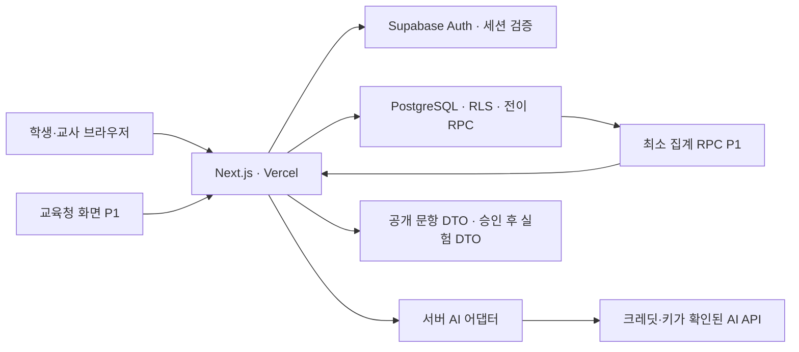

# 과학SOS · 반례실험실 TRD

Technical Requirements Document v1.0 · 2026-09-18

기준: [PRD v1.0](PRD.md). 상태: 구현 설계 완료, 애플리케이션·인프라 미구축. 이 문서는 클라우드 계정 연결이나 배포 완료를 의미하지 않는다.

## 1. 확정 사항과 연결 대상

| 항목 | 결정 | 현재 확인 상태 |
| --- | --- | --- |
| 소스 | GitHub `HyunjoJung/science-sos`, main | 기존 저장소 사용 |
| 프런트·API 호스팅 | Vercel | 사용자 지정; 프로젝트 미생성 |
| 인증·데이터베이스 | Supabase Auth + PostgreSQL | 사용자 지정; 프로젝트 미생성 |
| Vercel 소유 계정 | `j96263732@gmail.com`에 연결된 계정 | 사용자 지정; 실제 로그인·팀 ID 미확인 |
| Supabase 소유 계정 | `j96263732@gmail.com`에 연결된 계정 | 사용자 지정; 실제 로그인·조직 ID 미확인 |
| 개발용 AI | Cursor, 행사 크레딧 적용 가능하면 사용 | 쿠폰·잔액·만료·대상 계정 미확인 |
| 앱의 런타임 AI | 별도 API 공급자 어댑터; 행사 API 크레딧이 있으면 우선 검토 | 공급자·모델·키 미확정 |

Google 이메일이 같아도 Supabase 조직과 Vercel 팀은 별도 자원이다. 배포 시 로그인 이메일과 선택된 조직/팀을 각각 확인하고 ID를 기록한다. GitHub 계정은 기존 `HyunjoJung`을 사용하며 Vercel의 저장소 접근 권한을 별도로 연결한다.

위 이메일은 인프라 소유 계정 지정이다. 앱 이용자에게 Google 로그인을 강제하거나 해당 이메일에 교사 권한을 자동 부여하는 요구가 아니다. 이메일·비밀번호·토큰을 코드에 하드코딩하지 않는다.

## 2. 기술 스택

| 계층 | 기술 | 선택 이유 |
| --- | --- | --- |
| 웹 | Next.js App Router, React, TypeScript strict | 화면·서버 API를 같은 저장소에서 구현 |
| UI | Tailwind CSS, 접근성 있는 기본 컴포넌트, SVG/CSS 실험 | 모바일 학생 화면과 데스크톱 교사 화면 대응 |
| 서버 | Next.js Route Handlers, Vercel Node.js Functions | AI 키 보호, 입력 검증, 세션 기반 API |
| DB·인증 | Supabase PostgreSQL, Auth, `@supabase/supabase-js`, `@supabase/ssr` | 관계형 이력과 RLS, 쿠키 기반 인증 |
| 스키마 검증 | Zod | 요청·AI 응답의 런타임 검증 |
| 변경 관리 | Supabase CLI SQL migrations, 생성된 DB TypeScript 타입 | 제약·권한·RPC를 코드로 관리 |
| 테스트 | Vitest, Playwright, SQL/RLS 통합 검증 | 상태 전이·권한·시연 흐름 검증 |
| 패키지 | pnpm, lockfile 커밋 | 설치 재현성 |

구현 시 지원 중인 안정 버전을 설치하고 package.json과 lockfile에 실제 버전을 고정한다. Node.js도 Vercel 지원 LTS 중 선택해 engines에 고정한다. 이 문서는 최신 버전 번호를 추측하지 않는다.

P0에서는 ORM, 별도 Express 서버, Supabase Edge Functions, 벡터 DB, 파일 업로드, 외부 시뮬레이터, Realtime 구독을 추가하지 않는다. 화면 갱신은 인증된 API 폴링으로 시작한다.

## 3. 시스템 구조



브라우저는 Supabase publishable key로 인증할 수 있다. 업무 데이터 쓰기는 Route Handler와 제한된 RPC를 통해 수행한다. 일반 API는 사용자 JWT가 포함된 Supabase 클라이언트를 사용해 RLS를 유지한다. AI 결과 기록·관리 시드처럼 필요한 서버 작업만 secret key를 쓴다.

학생 답안·교사 카드 응답은 `Cache-Control: private, no-store`로 제공한다. 인증된 데이터를 전역 캐시나 정적 빌드 산출물에 넣지 않는다. 정답·예상 관찰 결과는 승인 전 클라이언트 번들에 포함하지 않는다.

## 4. 환경과 배포 구성

### 4.1 자원 이름과 격리

- Vercel 프로젝트 제안명: `science-sos`.
- Supabase 제안명: `science-sos-demo`와 개발·Preview용 `science-sos-dev`.
- Supabase project ref, Vercel team/project ID, 실제 URL은 생성 후 기록한다. 현재 값은 없다.
- Development는 가능하면 로컬 Supabase를 사용한다. Docker가 준비되지 않으면 dev 프로젝트를 사용한다.
- Preview는 dev DB, Production은 demo DB를 사용한다. 모든 Preview에서 동일 DB를 쓰는 동안 PR별 합성 데이터 namespace로 충돌을 막는다.
- 프로젝트 수·요금 제한으로 DB를 하나만 쓸 경우 Production만 연결하고 Preview의 DB 기능을 비활성화한다. 테스트와 시연이 같은 데이터를 초기화하도록 두지 않는다.
- Supabase는 서울 리전이 제공되면 우선 검토하고 Vercel Function도 가까운 리전으로 설정한다. 실제 제공 지역·플랜·프로젝트 설정을 확인한 뒤 확정한다.

### 4.2 환경 변수

| 변수 | 위치 | 목적 |
| --- | --- | --- |
| NEXT_PUBLIC_SUPABASE_URL | 브라우저·서버 | 프로젝트 URL |
| NEXT_PUBLIC_SUPABASE_PUBLISHABLE_KEY | 브라우저·서버 | 공개 클라이언트 키; 권한은 RLS로 통제 |
| SUPABASE_SECRET_KEY | 서버 전용 | AI 작업 기록·제한된 운영 작업 |
| APP_ORIGIN | 서버 | 허용 Origin·인증 리다이렉트 기준 |
| APP_MODE | 서버 | demo / pilot; P0는 demo만 |
| AI_MODE | 서버 | fixture / live; 기본 fixture |
| AI_PROVIDER | 서버 | xai 등 구현된 어댑터 이름 |
| AI_MODEL | 서버 | API 계정에서 확인한 모델 ID |
| AI_API_KEY | 서버 | 런타임 공급자 키 |
| AI_MAX_CALLS_PER_DAY | 서버 | 배포별 호출 상한; 초기 제안 100 |
| DEMO_RESET_ENABLED | 서버 | 기본 false; 데모 운영자만 초기화 허용 |

AI URL은 코드 내 공급자 allowlist로 결정한다. 사용자 요청이나 DB 입력으로 임의 URL을 호출하지 않는다. publishable key 외 비밀에 `NEXT_PUBLIC_` 접두사를 붙이지 않는다. `.env.example`에는 이름과 빈 값만 넣는다. Supabase CLI access token·DB 암호는 로컬/CI 비밀로만 관리하고 일반 Vercel 런타임에 배포하지 않는다.

### 4.3 배포 순서

1. 두 서비스에서 지정 이메일과 자원 소유 조직/팀 확인.
2. Supabase dev/demo 프로젝트 생성, 마이그레이션·합성 시드·RLS 적용.
3. Vercel에서 기존 GitHub 저장소 연결, Next.js 빌드 및 pnpm 설정.
4. 환경별 변수를 구분 등록하고 Auth Site URL/Redirect URL을 실제 배포 주소에 맞춤.
5. Preview에서 권한·상태 전이·AI 실패 검증 후 main을 Production에 배포.
6. Production URL에서 학생/교사 서로 다른 세션으로 전체 시연 검증.

P0 앱 로그인은 별도 Auth 설정이다. Google OAuth를 나중에 도입하면 Google Cloud 클라이언트와 콜백 등록이 추가로 필요하며, 인프라 Google 로그인만으로 자동 설정되지 않는다.

## 5. 인증과 권한

### 5.1 P0 인증 방식

- 운영자가 Supabase Auth에서 가상 학생·교사 계정을 생성하고 서버에서 membership을 배정한다.
- 이메일/비밀번호 로그인으로 시작한다. 자격 증명은 저장소·프런트 코드·문서에 넣지 않는다.
- 공개 회원가입을 열지 않는다. 학생은 고정 합성 계정으로 시연하고 실제 이름을 저장하지 않는다.
- 역할 선택 UI만으로 JWT·권한을 바꾸지 않는다. 데모에서 역할을 전환하려면 실제 별도 계정 세션으로 로그인한다.
- 서버는 Supabase SSR 클라이언트와 검증된 claims/user를 사용한다. 쿠키의 session 객체만 신뢰해 권한을 부여하지 않는다.
- 사용자 수정 가능한 metadata에 teacher 역할을 두지 않는다. DB membership이 권한의 기준이다.

### 5.2 권한 경계

| 자원 | 학생 | 담당 교사 | 교육청 P1 |
| --- | --- | --- | --- |
| 공개 문항·조건 | 수업 내 조회 | 담당 수업 조회 | 접근 불필요 |
| 학생 원문·수정 | 본인 조회; RPC로 작성 | 담당 학급 조회 | 금지 |
| AI 제안 | 원문 가설 카드 금지; 승인된 질문만 | 담당 학급 조회 | 금지 |
| 교사 결정·실험 배정 | 본인 배정 결과만 | 검토·배정 RPC | 금지 |
| 정답·평가 키 | 응답 전 금지 | 담당 콘텐츠 조회 | 금지 |
| 집계 | 접근 불필요 | 담당 학급 | 승인된 범위의 집계만 |

RLS는 행 단위 통제이므로 숨겨야 하는 정답·AI 내부 근거를 학생에게 보이는 행의 다른 컬럼으로 섞지 않는다. 비공개 테이블/스키마로 분리한다. Data API에 노출되는 테이블은 SQL 마이그레이션에서 RLS를 명시적으로 활성화한다.

RPC가 `SECURITY DEFINER`를 사용하는 경우 고정 search_path, 완전 수식 테이블명, `auth.uid()`와 membership 확인, 허용 전이·컬럼 검증을 함수 안에서 수행한다. PUBLIC/anon 기본 execute 권한을 회수하고 필요한 역할에만 부여한다. 일반 테이블 직접 INSERT/UPDATE/DELETE는 허용하지 않는다.

## 6. 데이터베이스 명세

ID는 UUID, 시각은 timestamptz UTC, UI는 Asia/Seoul로 표시한다. 콘텐츠 버전·답안 버전은 양의 정수다. FK에는 index를 두고 enum/check constraint로 상태와 가설 값을 제한한다.

| 테이블 | 핵심 필드·제약 |
| --- | --- |
| profiles | user_id PK → auth.users, display_alias; 역할은 별도 membership |
| classes | id, name, demo_namespace |
| class_memberships | class_id, user_id, role(student/teacher), unique(class_id,user_id) |
| learning_sessions | id, class_id, status, content_version |
| items | id, version, phase, public_conditions JSONB, choices JSONB, paired_item_id; unique(id,version) |
| private.item_keys | item_id/version, correct_answer, rubric_mapping; 학생 권한 없음 |
| private.experiments | id/version, conditions, expected_observation, templates, review_status |
| thought_records | id, student_user_id, class_id, session_id, item_id/version, current_attempt_id |
| attempts | id, record_id, version, prediction JSONB, reason_text, state, stuck_at, created_at; unique(record_id,version) |
| private.ai_jobs | id, attempt_id, input_hash, status, lease_until, provider, model, latency_ms, usage JSONB |
| private.ai_proposals | job_id unique, hypothesis, reason_status, evidence_quotes, template_ids, experiment_id, validation_status |
| teacher_reviews | id, attempt_id, teacher_id, decision, final_hypothesis, edit_note, created_at |
| assignments | id, attempt_id, review_id, experiment_id/version, approved_at, revoked_at, observed_at |
| observations | id, assignment_id unique, result_version, student_note, observed_at |
| revisions | id, attempt_id unique, revised_text, changed_spans JSONB, no_change, self_note_chips, self_note_text |
| reassessments | id, attempt_id unique, item_id/version, prediction, reason_text, submitted_at |
| rubric_assessments | id, response_id/type, rubric_version, dimension_scores JSONB, reviewed_by, reviewed_at |
| private.idempotency_keys | actor_id, route, key, request_hash, resource_id; unique(actor_id,route,key) |
| private.audit_events | id, record_id, actor_id, action, from_state, to_state, request_id, timestamp |
| private.ai_usage_daily | environment, day_utc, reserved_calls, completed_calls; unique(environment,day_utc) |

AI 제안과 학생용 DTO는 분리한다. 감사 로그에 원문이나 API 키를 복제하지 않는다.

### 제약

- reason_text/revised_text/reassessment reason은 trim 후 1~300자, self_note_text는 200자 이내다. 글자 수는 Unicode 코드 포인트 기준으로 통일한다.
- attempt 하나당 취소되지 않은 assignment는 최대 1개이며 부분 unique index로 보장한다.
- 상태 변경 RPC는 관련 행을 잠그고 기대 version과 현재 state를 검증한다.
- observed 이후 assignment는 삭제·덮어쓰기하지 않고 새 attempt로 변경을 기록한다.
- `hypothesis=hold` 또는 교사 decision=hold이면 assignment를 생성할 수 없다.
- 미채점은 NULL로 두어 0점과 구분한다. DB에서 점수 범위 0~2를 검증한다.

## 7. 상태 전이와 트랜잭션

PRD 상태 enum을 그대로 사용한다. 다음 RPC가 업무 쓰기의 유일한 진입점이다.

| RPC | 트랜잭션 내 작업 |
| --- | --- |
| submit_attempt | 본인·수업 검증 → 현재 버전 잠금 → 답안 생성 → analyzing → AI job 예약 → audit |
| review_and_assign | 담당 교사 검증 → 현재 attempt 잠금 → 확인/수정 저장 → 승인 실험 검증 → assignment 생성 → experiment_assigned → audit |
| hold_attempt | 담당 교사 검증 → 진행 전 배정 취소 → needs_more_reason → 중립 질문 지정 → audit |
| resubmit_reason | 본인·보류 상태 검증 → 새 immutable attempt → 이전 미실행 배정 취소 → 새 AI job |
| observe_assignment | 소유자·유효 배정 검증 → 고정 결과 버전 기록 → observed |
| submit_revision | 본인·observed 검증 → 수정/변경 구간 저장 → revised |
| submit_reassessment | 대응 문항·본인·revised 검증 → 새 답안 저장 → reassessed |
| complete_review | 담당 교사·재확인 답안 검증 → 루브릭·완료 기록 → completed |

교사 confirm과 실험 배정은 한 트랜잭션으로 처리한다. 부분 저장으로 확인만 되었는데 실험이 열리거나, 감사 기록 없이 배정되는 상태를 만들지 않는다. UI의 낙관적 업데이트는 승인 성공 응답 이후에만 실험 접근에 반영한다.

## 8. HTTP API 계약

요청은 JSON, 모든 업무 API는 로그인 필요. 변경 요청은 Origin 검증과 세션 검증을 수행하고 SameSite 쿠키를 사용한다. POST에는 Idempotency-Key를 요구한다. 같은 key·다른 payload는 409다.

| Method / path | 요청 핵심 | 응답·행동 |
| --- | --- | --- |
| GET /api/session | 없음 | 사용자 alias·서버에서 계산한 role·허용 class |
| GET /api/items/:id | sessionId | 공개 조건·선택지만 |
| POST /api/records/:id/attempts | expectedVersion, prediction, reasonText | 201 attemptId·analyzing; AI job 예약 |
| POST /api/attempts/:id/analyze | attemptVersion | 사용자 소유 확인 후 예약 job 실행; 원본 AI 응답 대신 처리 상태 |
| GET /api/attempts/:id | 없음 | 역할별 필드를 제한한 DTO |
| GET /api/teacher/groups | classId, sessionId | 가설·검토 상태 묶음; 담당 권한 필요 |
| GET /api/teacher/attempts/:id | 없음 | 교사 근거 카드 DTO |
| POST /api/teacher/attempts/:id/review | expectedVersion, decision, hypothesis, experimentId, editNote | 결정·배정을 원자적으로 반영 |
| GET /api/assignments/:id/experiment | 없음 | 본인 유효 승인 확인 후 실험 조건·결과 DTO |
| POST /api/assignments/:id/observe | studentNote | 관찰 완료 |
| POST /api/attempts/:id/revision | revisedText, changedSpans, selfNote | 수정 기록 |
| POST /api/attempts/:id/reassessment | itemId, prediction, reasonText | 재확인 저장 |
| POST /api/teacher/attempts/:id/complete | rubricVersion, scores | 교사 완료 |
| GET /api/district/summary (P1) | 허용된 coarse filters | 원문·ID 없는 집계 |
| POST /api/demo/reset | namespace | 운영자 전용; 해당 합성 데이터만 초기화 |

오류 envelope: `{error:{code,message,requestId}}`. 401 세션 없음, 403 역할 불가, 404 접근 가능한 자원 없음, 409 오래된 버전/상태 충돌, 422 검증 오류, 429 호출 상한, 503 AI 사용 불가. 응답에 SQL 상세·스택·키·다른 학생 정보는 넣지 않는다.

## 9. AI 실행 설계

### 9.1 공급자 어댑터

`analyzeReason(input): Promise<ValidatedProposal>` 인터페이스를 둔다. PRD의 JSON 필드·enum을 Zod로 검증한다. 근거 인용은 reason_text의 실제 substring이어야 하며, experiment/template ID는 현재 콘텐츠 allowlist와 대조한다.

서버가 attempt에서 입력을 다시 읽고 문항 조건과 검토 템플릿을 결합한다. 클라이언트가 전달한 원문·모델·system prompt를 그대로 실행하지 않는다. 이름·학교·다른 학생 답안을 공급자에 보내지 않는다. 가설만 제안하며 도구 호출·웹 검색·코드 실행은 사용하지 않는다.

### 9.2 동기 작업과 복구

1. 답안 저장 요청에서 job을 예약하고 즉시 응답한다.
2. 클라이언트가 analyze 요청을 보내면 서버가 job lease를 원자적으로 확보한다. 동일 job의 중복 호출은 기존 상태를 반환한다.
3. 10초에 화면 지연 안내, 공급자 요청은 AbortController로 15초 제한. Function maxDuration은 30초로 설계하고 실제 플랜 지원 여부를 배포 시 검증한다.
4. 검증된 응답만 저장한다. `current_attempt_id`와 job version이 일치하지 않으면 stale 처리하고 최신 상태를 변경하지 않는다.
5. 실패 시 awaiting_review로 넘기고 job에 error 유형을 남긴다. 교사 직접 검토 가능.
6. 프로세스가 종료되어 lease만 남으면 다음 조회/명시적 재시도에서 만료를 감지한다. 늦게 돌아온 결과는 lease token 일치 시에만 반영한다.

함수 응답 후 실행될 것이라고 가정한 fire-and-forget 작업은 사용하지 않는다. 자동 무한 재시도는 하지 않는다. 같은 입력·콘텐츠·모델·prompt 버전은 동일 작업으로 중복 제거하되 사용자가 수동 재시도하면 새 job 세대로 기록한다.

### 9.3 비용·크레딧

| 비용 | 사용 계획 | 검증 조건 |
| --- | --- | --- |
| Cursor 개발 지원 | 행사 크레딧으로 코드 작성·수정·테스트 보조 우선 | 실제 쿠폰 대상 계정·적용 범위·잔액·만료 확인 |
| 앱 AI API | 행사 Grok/xAI API 크레딧이 별도 제공되면 우선 검토 | API 콘솔에서 키 발급·모델 접근·크레딧 차감 확인 |
| Vercel·Supabase | 현재 계정 플랜과 가용 자원 확인 후 소규모 데모 | 특정 무료 한도·무과금 보장하지 않음 |

Cursor에서 코딩 모델을 사용하는 비용과 배포된 웹앱이 외부 API를 호출하는 비용을 분리한다. Cursor BYOK 문서는 공급자 모델 비용을 공급자가 청구한다고 설명한다. 행사 Cursor 크레딧이 외부 앱 API 사용권이라는 근거는 아직 확인하지 못했다. Cursor의 세션·내부 endpoint를 앱 AI 서버로 재사용하지 않는다.

런타임 키·크레딧이 확인되기 전 기본은 fixture 모드다. fixture는 정해진 시드 답안에만 매칭하고 `예시 분석 · 실시간 AI 아님`을 표시한다. 일치하지 않는 자유 입력에는 만들어낸 분석을 주지 않고 교사 검토로 보낸다.

초기 비용 제어: 사용자당 분석 5회/분, 배포 전체 100회/일 제안값. DB에서 원자적으로 예약·차감하고 공급자 자체 예산 한도도 확인한다. 호출 수 제한은 달러 비용 상한과 동일하지 않으므로 모델별 토큰 사용량을 별도로 기록한다. 한도 도달 시 429와 교사 직접 검토를 제공한다.

## 10. 실험·변경 문장 구현

- PRD의 밀도 3실험을 승인 후 내려받은 데이터로 SVG/CSS 렌더링한다. 물리 엔진 없이 고정 결과를 표현한다.
- 학생 문항에는 예측에 필요한 조건만 전달한다. 승인 전 결과 endpoint 접근은 DB 상태로 거절한다.
- 단위·질량/부피/밀도 계산을 콘텐츠 검증 스크립트로 확인한다.
- 설명 비교는 어절 diff를 기본으로 하되 최종 변경 구간은 학생이 확인한다. `changed_spans`는 code point 기준 offset과 답안 버전을 기록한다.
- 애니메이션은 reduced-motion 설정을 존중하고 동일 내용을 텍스트로 제공한다.
- AI 분석 상태 폴링은 2초, 교사 대기 화면은 5초 간격 제안. 숨겨진 탭에서는 중단하고 완료/실패 시 종료한다. Realtime은 후속 최적화다.

## 11. 교육청 집계 P1

집계는 서버 RPC에서만 수행한다. 교육청 계정은 학생 원문 테이블에 권한이 없다. cohort별 고유 학생 수·분모·결측·미실시를 계산한 DTO만 반환한다.

5명 미만 셀과 그 보완 값으로 역산 가능한 총계는 함께 숨긴다. 자유로운 날짜·조합 필터는 제공하지 않고 고정 기간·학년·단원 묶음으로 제한해 반복 질의에 의한 추론을 줄인다. 임의 SQL이나 row-level export는 제공하지 않는다. 수정률과 개념 도달률을 분리한다.

## 12. 저장소 구조와 마이그레이션

```text
src/
  app/(auth)/login/
  app/(student)/student/
  app/(teacher)/teacher/
  app/(district)/district/       # P1
  app/api/
  components/experiments/
  components/thought-record/
  lib/supabase/{browser,server,admin}.ts
  lib/auth/authorize.ts
  lib/ai/{adapter,schema,fixture,xai}.ts
  lib/domain/{state-machine,dto,validation}.ts
  lib/content/public-items.ts
  types/database.ts
supabase/
  migrations/
  seed.sql                      # 합성 데이터만
tests/{unit,integration,e2e}/
docs/{PRD,TRD}.md
.env.example
```

admin 클라이언트와 공급자 어댑터에는 server-only 경계를 둔다. 비공개 실험 결과를 public-items나 정적 public 디렉터리에 넣지 않는다.

마이그레이션 순서: 001 테이블·제약 → 002 RLS·권한 → 003 전이 RPC·감사 → 004 콘텐츠 시드 → 005 AI 작업·사용량 → 006 집계(P1). 적용된 마이그레이션은 수정하지 않고 새 파일로 변경한다. 데이터 보존을 위해 expand-contract 변경을 우선한다.

## 13. 검증·관측·복구

### 검증

- 단위: 상태 전이, 원문 인용 검증, stale 응답 거절, 정답/이유 부족 구분, 콘텐츠 계산, 변경 구간.
- DB 통합: 서로 다른 학생 A/B, 교사 A/B, 교육청 역할로 접근 경계를 실제 JWT로 확인. secret key를 쓰는 테스트만으로 RLS 통과를 주장하지 않는다.
- 원자성: 동시에 두 교사가 배정, 중복 제출, 배정 취소와 관찰 경합, 재제출과 AI 완료 경합.
- E2E: PRD AC01~11·13~14, 교육청 구현 시 AC12. 학생·교사는 별도 브라우저 context로 실행한다.
- 배포: lint·typecheck·단위/통합 테스트·Next build → Preview smoke → Production smoke.

### 로그와 운영

Vercel 로그에는 requestId, route, 상태 코드, 처리 시간, AI job ID·provider·usage만 기록한다. 답안 원문·인용·자기 메모·인증 쿠키·키는 로그에 넣지 않는다. DB 감사 로그는 결정·상태·행위자·시각을 기록한다.

DB 장애 시 저장됐다고 표시하지 않고 입력을 화면에 유지해 재시도를 제공한다. AI 장애 시 수업 기록·교사 검토는 계속 가능해야 한다. health 응답은 서비스 상태만 노출하고 프로젝트 키나 내부 오류를 반환하지 않는다.

이전 Vercel 배포로 앱을 되돌릴 때 DB 스키마 호환성을 먼저 확인한다. DB 되돌리기는 파괴적 down migration 대신 forward fix를 우선한다. 초기화 endpoint는 demo_namespace의 합성 행만 대상으로 하며 실제 실증 환경에서는 비활성화한다.

## 14. 구현 순서와 완료 기준

1. Next.js 뼈대·Supabase 로컬 스키마·합성 콘텐츠·권한 구성.
2. 학생·교사 실제 세션과 submit/review/assign RPC 구현.
3. fixture 모드로 관찰·설명 수정·재확인 전체 흐름 완성.
4. 공급자 키·크레딧 확인 후 live 어댑터, 실패·비용 제어 연결.
5. 지정 계정 소유 프로젝트로 Preview/Production 배포와 PRD 수용 기준 검증.
6. P0 통과 후 교육청 집계 P1 구현.

TRD 완료는 문서 작성 상태다. 시스템 완료는 저장·권한·게이트·실패 복구·배포 smoke 검증이 통과하고 실제 프로젝트 ID/URL이 기록된 상태다. Cursor/Grok 크레딧을 적용했다고 보고하려면 계정에서 적용 또는 실제 차감 증거를 확인해야 한다.

## 15. 공식 문서와 미확정 항목

2026-09-18 공식 문서 확인. 아래는 플랫폼 근거이며 이 TRD의 모든 설계 선택이 플랫폼 기본값이라는 뜻은 아니다.

- [Supabase Next.js 시작](https://supabase.com/docs/guides/getting-started/quickstarts/nextjs): Next.js·쿠키 인증·publishable key 구성.
- [Supabase SSR](https://supabase.com/docs/guides/auth/server-side): 서버·클라이언트 인증 구성.
- [Supabase RLS](https://supabase.com/docs/guides/database/postgres/row-level-security): 역할별 행 접근과 privileged key 주의사항.
- [Vercel Function 설정](https://vercel.com/docs/functions/configuring-functions), [실행 시간](https://vercel.com/docs/functions/configuring-functions/duration): 런타임·리전·기간은 실제 플랜과 맞춰 설정.
- [Vercel 환경 변수](https://vercel.com/docs/environment-variables): 배포 환경별 변수 관리.
- [Cursor BYOK](https://cursor.com/help/models-and-usage/api-keys): IDE 사용과 공급자 API 청구 구분.
- [Grok API 문서](https://docs.x.ai/overview): 런타임 공급자 후보. 행사 크레딧 적용 여부·모델 ID는 별도 확인 필요.

미확정: 실제 두 계정 로그인·조직/팀 ID, 자원 플랜·리전·프로젝트 ref, Cursor 쿠폰과 잔액, 별도 Grok API 크레딧, 공급자 모델 ID·한도. 이 값들은 구현 연결 단계에 확인하며 TRD 작성을 막는 조건은 아니다.
